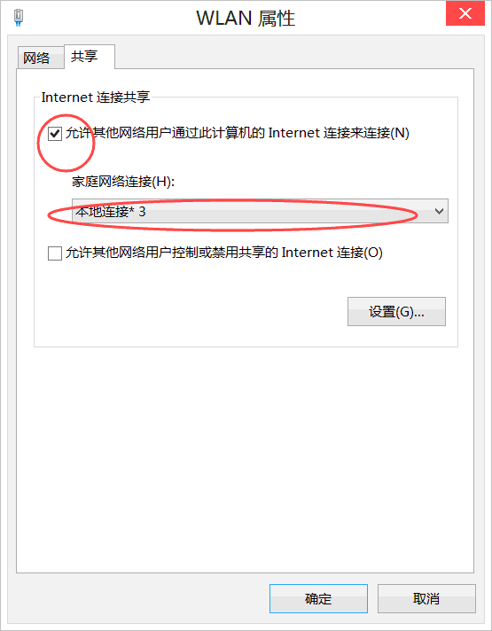
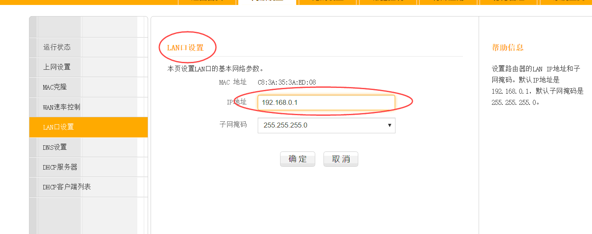

# wifi.bat
**笔记本windows系统**打开wifi的批处理

## 使用方法
修改**wifi.bat**中的`ssid`(wifi名)和`key`(wifi密码)

### 注意
#### 注意1
bat批处理代码前段为打开管理员模式, 
但在windows某些系统下不需要打开, 则将 :Admin 以上代码注释掉即可(详情见代码)    

#### 注意2
若出现

**则右击wlan(或以太网)的属性**

将**允许其他网络用户通过此计算机的Internet连接来连接**勾上 
并选择创建刚创建的那个连接
  
#### 注意3
若出现**无法启动internet连接,为LAN连接配置的IP地址需要使用自动ip寻址**的错误, 是因为你的路由器的界面ip占用了`192.168.0.1`

**解决办法**
只需进入路由器界面  

   
将IP地址改成`192.168.1.1`即可
