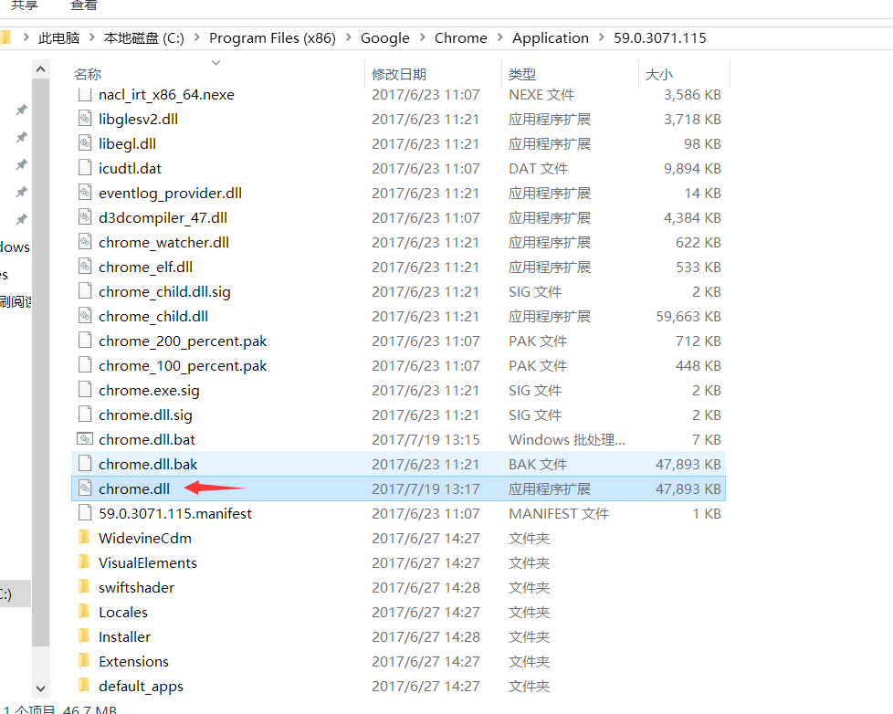

# 解决 "请停用以开发者模式运行的扩展程序"

## Chrome 所有版本, 比如71版本均可行的办法
**见博文**: **[[Chrome 71版本]彻底解决Chrome请停用以开发者模式运行的扩展程序https://vonsdite.cn/posts/d0e30452.html](https://vonsdite.cn/posts/d0e30452.html)**, 备用地址: https://blog.csdn.net/VonSdite/article/details/86493684  

## Chrome 63版本以前可行的办法
- ~找到 Chrome的 chrome.dll所在的目录~

- ~将本项目中的**chrome.dll.bat**和**chrome.dll.bak**复制到该目录下, **并以管理员方式运行chrome.dll.bat**, 运行完即可解决问题~

